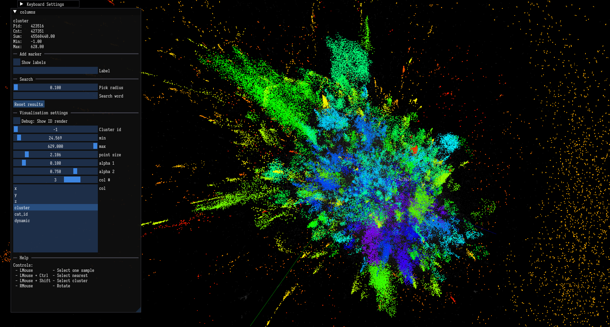

# Point Cloud Viewer

A real-time OpenGL 3.3 point-cloud viewer for large dimensionality-reduction outputs (UMAP, t-SNE). Visualize and interact with high-dimensional datasets projected to 3D with an intuitive game-like interface.



## Features

### 🎮 Game-Like Controls
- **Mouse Right Button**: Smooth orbit camera around points
- **Mouse Middle Button**: Pan camera in view plane (screen-relative)
- **Mouse Wheel**: Zoom in/out
- **WASD**: Game-style movement relative to camera (like FPS games)
- **Space/LCtrl**: Move up/down
- **Customizable Keybindings**: Click buttons in UI to rebind keys to your layout

### 📐 Advanced Camera
- **Quaternion-based rotation**: No gimbal lock, smooth at all angles
- **Screen-relative controls**: Rotation and panning feel intuitive like Blender/Maya
- **Dynamic up vector**: Handles vertical orientations correctly
- **Smooth easing**: Camera smoothly transitions to targets

### 🔍 Data Visualization
- **Multi-column coloring**: Color points by any data column
- **Range filtering**: Filter points by value range (min/max sliders)
- **Point size control**: Adjust point size for visibility
- **Alpha blending**: Semi-transparent points for depth perception
- **Large dataset support**: 500k+ points with real-time rendering

### 🏷️ Interactive Features
- **GPU picking**: Click points to focus camera (select via picking)
- **Cluster analysis**: View per-cluster statistics
- **Label system**: Add/save persistent labels to points
- **Search**: Find points by nearest neighbor or cluster membership
- **Message display**: View per-point associated data/text

### ⚙️ Persistent Configuration
- **Autosave settings**: Keyboard bindings saved to `point_cloud_settings.cfg`
- **Window layout**: ImGui remembers window positions across sessions
- **Settings survive restarts**: All customizations persist

## Build & Run

### Prerequisites
```bash
# On Linux (Ubuntu/Debian):
sudo apt-get install libglfw3-dev libz-dev cmake build-essential

# On macOS:
brew install glfw3 cmake
```

### Build
```bash
cd point.cloud

# First time: fetch submodules
./pull_submodules.sh

# Generate build system (downloads GLFW 3.4)
cmake .

# Build (parallel recommended for speed)
make -j4 point_cloud
```

### Run
```bash
cd bin
./point_cloud [--cluster_col=N] [--categories_start=N] <dataset-prefix>
./point_cloud --help
```

### Example
```bash
# View the 500k-point FRIDA dataset
./point_cloud data/frida.500k

# View semi-supervised dataset (smaller)
./point_cloud data/al.ru.semisup
```

## Data Format

Input: gzipped TSV with header row. Columns: `x, y, z, [clust], [categories...]`

- **First 3 columns**: 3D coordinates (x, y, z)
- **Cluster column** (optional): Cluster ID for grouping (auto-detected if named `clust`)
- **Category columns** (optional): Per-cluster category statistics
- **All cells**: Must parse as floats

Example files in `bin/data/`:
- `frida.500k.floats.tsv.gz` — 500k points, main demo dataset
- `frida.500k.unsup.floats.tsv.gz` — Unsupervised clustering variant
- `al.ru.semisup.floats.tsv.gz` — Semi-supervised, smaller dataset

## Controls Reference

### Camera
| Input | Action |
|-------|--------|
| Right Mouse Drag | Orbit around target |
| Middle Mouse Drag | Pan in view plane |
| Scroll Wheel | Zoom (adjust distance) |
| **W** | Move forward (along view) |
| **A** | Move left (strafe) |
| **S** | Move backward |
| **D** | Move right (strafe) |
| **Space** | Move up |
| **LCtrl** | Move down |

### UI
| Input | Action |
|-------|--------|
| Left Mouse Click (on point) | Focus camera + show stats |
| Ctrl+Click | Find nearest points |
| Shift+Click | Find same-cluster points |
| Left Mouse Drag (in UI) | Move/resize windows |

### Settings
- **Keyboard Settings Window**: Configure keybindings (click button, press key to rebind)
- **Column Selection**: Choose which column to color by
- **Filtering**: Adjust min/max range
- **Appearance**: Point size, alpha/transparency
- **Debug Mode**: Visualize GPU picking ID encoding

## Architecture

This is a small (~10 source files), tightly-integrated codebase using mutable global state for camera/render parameters. For architecture details, data flow, and code patterns, see **[CLAUDE.md](CLAUDE.md)**.

Key components:
- **Camera**: Quaternion-based rotation (no gimbal lock), smooth easing
- **Rendering**: OpenGL 3.3 with alpha blending, GPU picking via FBO
- **Data**: Flat array + 3D k-d tree spatial index, cluster aggregation
- **UI**: ImGui (cimgui C bindings) for settings and analysis
- **Input**: GLFW callbacks, screen-relative rotations, keyboard rebinding

## Dependencies

- **GLFW 3.4** (auto-downloaded via CMake FetchContent)
- **cimgui** (Dear ImGui C bindings, vendored as submodule)
- **cglm** (3D math, quaternions, matrix ops)
- **gl3w** (OpenGL 3.3 loader)
- **klib** (ketopt for CLI parsing)
- **kdtree** (spatial index for nearest-neighbor)
- **zlib** (decompress .gz data files)
- **pthread** (async HTTP in curl module)

## Camera Behavior

The camera orbits around a **target point** at a fixed **radius** with smooth easing:
- Rotation is **quaternion-based** — no gimbal lock even when vertical
- **Screen-relative** — rotation axes align with what you see, not world axes
- **Panning** moves the target in the camera's view plane
- **Zoom** adjusts orbital radius (scroll wheel)
- **Smooth transitions** — camera eases toward new targets over time

## Keyboard Layout

Built for **QWERTY** scancodes by default:
- W=26, A=38, S=39, D=40, Space=65, LCtrl=50

**Non-QWERTY users**: Use the Keyboard Settings window to rebind keys to your physical layout (Dvorak, Colemak, etc.). Bindings persist in `point_cloud_settings.cfg`.

## Tips

- **Large datasets**: Start with a smaller dataset to test controls before loading 500k+ points
- **Performance**: Parallel build is fast (`make -j4`)
- **Camera stuck?**: Press W/A/S/D to ensure camera focus; check Keyboard Settings
- **Points not visible?**: Adjust min/max filter range or point size slider
- **Debug picking**: Enable "Debug: Show ID render" to visualize GPU picking (slow, only for troubleshooting)

## License

See repository root for license information.

## Development

See **[CLAUDE.md](CLAUDE.md)** for:
- Build system details (CMake in-source)
- Architecture deep-dive
- Data structures and rendering pipeline
- Conventions and code patterns

---

**Built with**: C, OpenGL 3.3, ImGui, cglm, GLFW  
**For**: Visualizing high-dimensional datasets from dimensionality reduction
